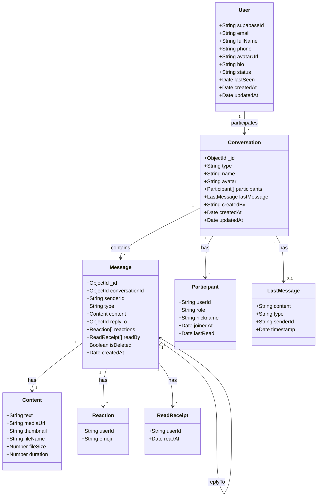
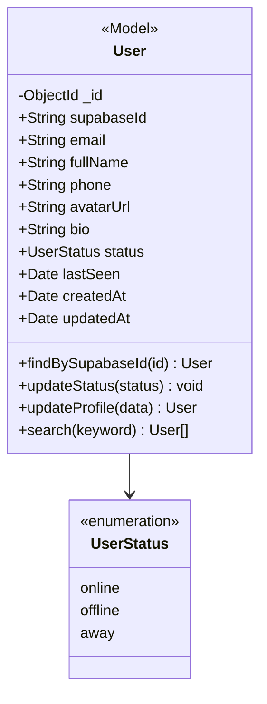
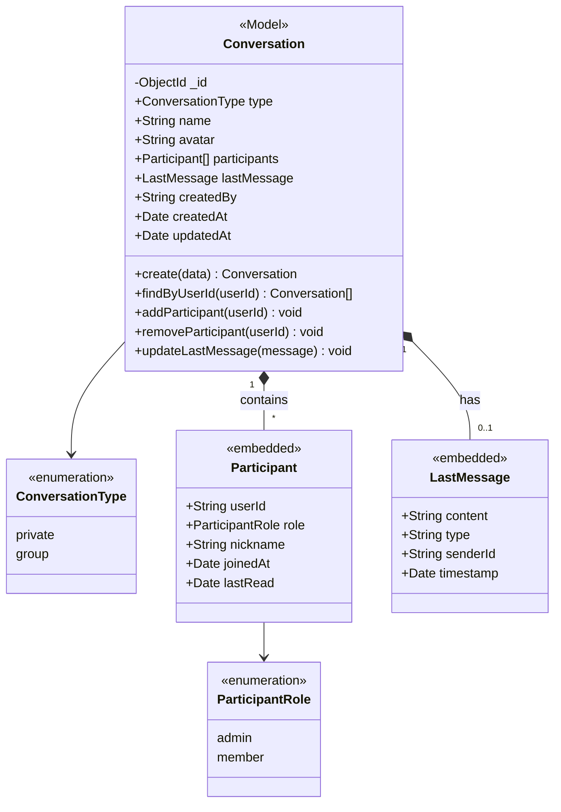
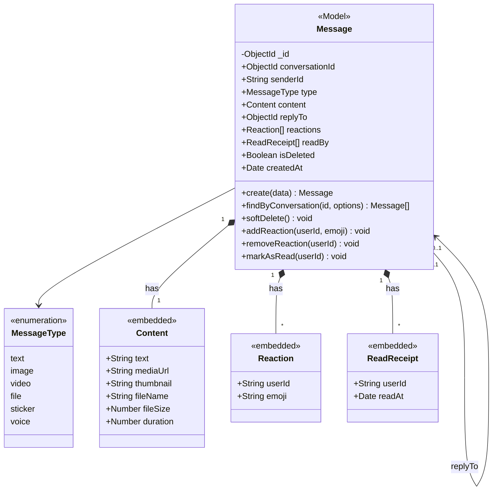
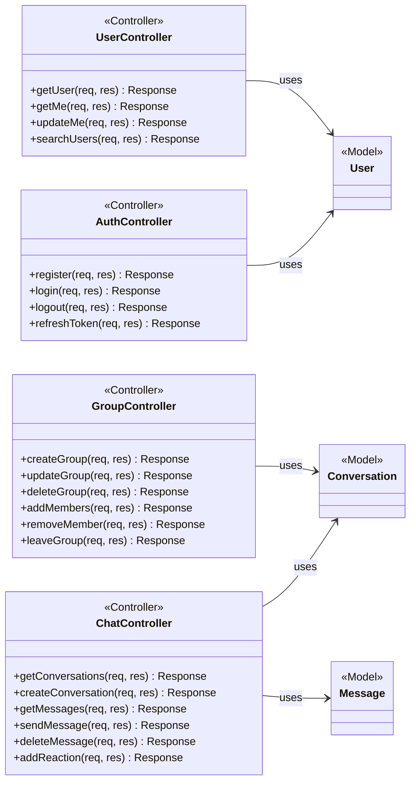
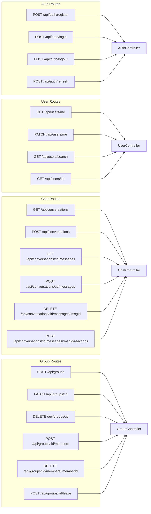
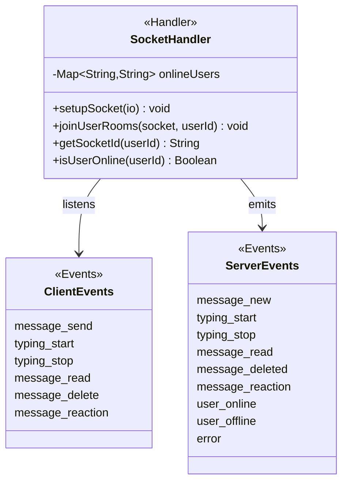
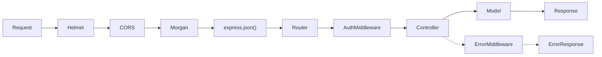
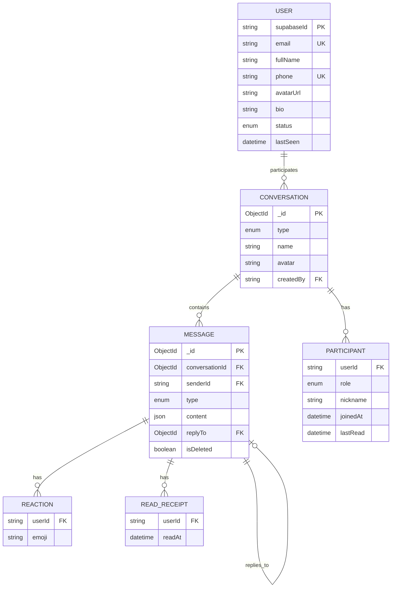

# 📊 Class Diagram - Zalo Faker

> Sơ đồ lớp chi tiết cho ứng dụng chat

---

## 1. Tổng Quan Hệ Thống



---

## 2. Chi Tiết Từng Class

### 2.1 User Class



| Thuộc tính | Kiểu | Mô tả | Bắt buộc |
|------------|------|-------|----------|
| `supabaseId` | String | ID từ Supabase Auth | ✅ |
| `email` | String | Email đăng nhập | ✅ |
| `fullName` | String | Họ tên | ✅ |
| `phone` | String | Số điện thoại | ❌ |
| `avatarUrl` | String | URL ảnh đại diện | ❌ |
| `bio` | String | Giới thiệu bản thân (max 200 ký tự) | ❌ |
| `status` | Enum | Trạng thái: online/offline/away | ✅ |
| `lastSeen` | Date | Thời điểm online cuối | ❌ |

---

### 2.2 Conversation Class



| Thuộc tính | Kiểu | Mô tả | Bắt buộc |
|------------|------|-------|----------|
| `type` | Enum | private (1-1) hoặc group | ✅ |
| `name` | String | Tên nhóm (chỉ cho group) | ❌ |
| `avatar` | String | Avatar nhóm | ❌ |
| `participants` | Array | Danh sách thành viên | ✅ |
| `lastMessage` | Object | Tin nhắn cuối cùng | ❌ |
| `createdBy` | String | ID người tạo | ✅ |

---

### 2.3 Message Class



| Thuộc tính | Kiểu | Mô tả | Bắt buộc |
|------------|------|-------|----------|
| `conversationId` | ObjectId | ID cuộc hội thoại | ✅ |
| `senderId` | String | ID người gửi (supabaseId) | ✅ |
| `type` | Enum | Loại tin nhắn | ✅ |
| `content` | Object | Nội dung tin nhắn | ✅ |
| `replyTo` | ObjectId | ID tin nhắn được trả lời | ❌ |
| `reactions` | Array | Danh sách reactions | ❌ |
| `readBy` | Array | Danh sách đã đọc | ❌ |
| `isDeleted` | Boolean | Đã xóa (soft delete) | ✅ |

---

## 3. MVC Architecture



---

## 4. Routes Mapping



---

## 5. Socket Events



| Client Event | Server Response | Mô tả |
|--------------|-----------------|-------|
| `message:send` | `message:new` | Gửi tin nhắn mới |
| `typing:start` | `typing:start` | Bắt đầu gõ |
| `typing:stop` | `typing:stop` | Dừng gõ |
| `message:read` | `message:read` | Đánh dấu đã đọc |
| `message:delete` | `message:deleted` | Xóa tin nhắn |
| `message:reaction` | `message:reaction` | Thêm reaction |
| (connect) | `user:online` | User online |
| (disconnect) | `user:offline` | User offline |

---

## 6. Middleware Chain



---

## 7. Relationships Summary



---

## 8. Hướng Dẫn Triển Khai

### Thứ Tự Implement

```
1. User Model      → Quan trọng nhất, là nền tảng
2. Conversation    → Phụ thuộc User
3. Message         → Phụ thuộc Conversation
4. Controllers     → Sau khi có Models
5. Routes          → Sau khi có Controllers
6. Socket          → Cuối cùng, cho real-time
```

### Mapping File ↔ Class

| Class | File Location |
|-------|---------------|
| `User` | `server/src/models/User.ts` |
| `Conversation` | `server/src/models/Conversation.ts` |
| `Message` | `server/src/models/Message.ts` |
| `AuthController` | `server/src/controllers/authController.ts` |
| `UserController` | `server/src/controllers/userController.ts` |
| `ChatController` | `server/src/controllers/chatController.ts` |
| `GroupController` | `server/src/controllers/groupController.ts` |
