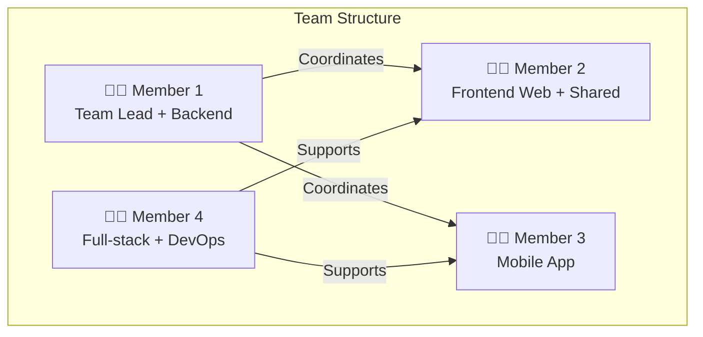
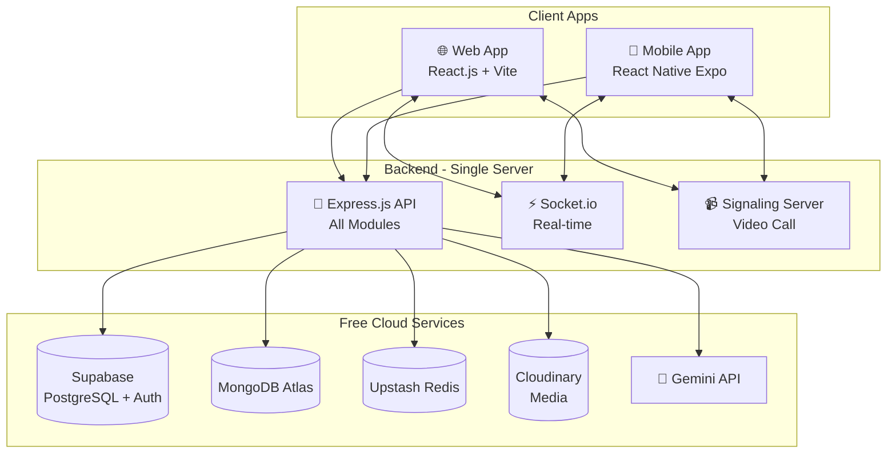
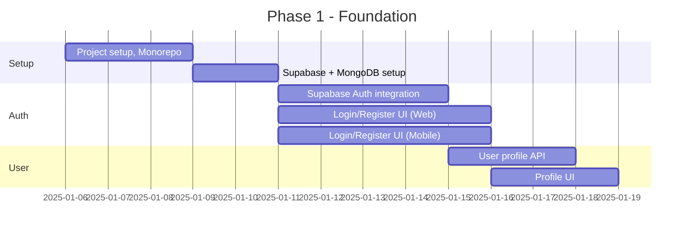
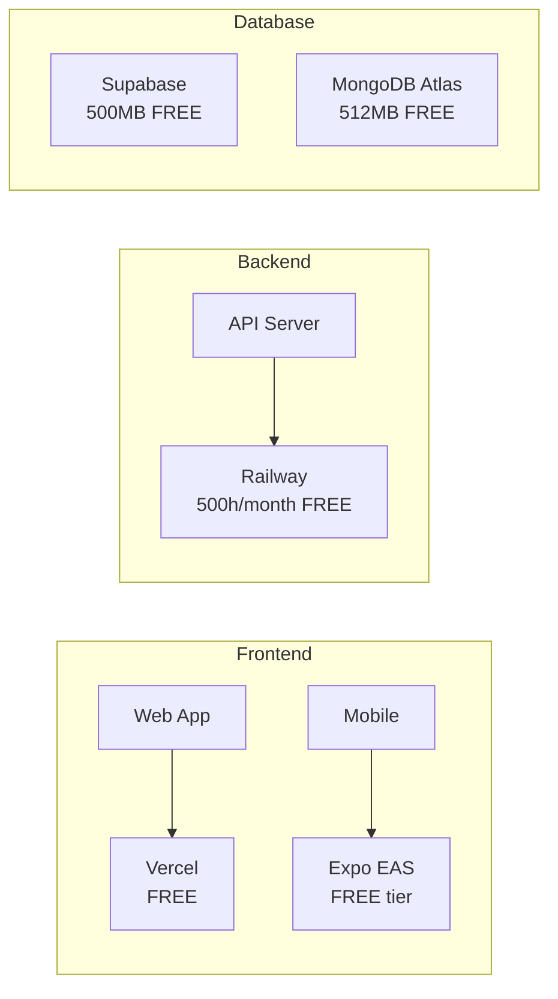

# 📱 Kế Hoạch Phát Triển Ứng Dụng Nhắn Tin - Zalo Faker

## 🎯 Tổng Quan Dự Án

> [!NOTE]
> **Phiên bản điều chỉnh cho team sinh viên 4 người, không có ngân sách**

Xây dựng ứng dụng nhắn tin đa nền tảng (Web + Mobile) với đầy đủ tính năng chat, voice/video call, quản lý tài khoản, và hỗ trợ AI chatbot - sử dụng **100% công nghệ miễn phí**.

---

## 👥 Phân Công Team 4 Người



| Thành viên | Vai trò chính | Trách nhiệm |
|------------|---------------|-------------|
| **Member 1** | Team Lead + Backend | Quản lý dự án, Auth, User, Chat API, Database |
| **Member 2** | Frontend Web | React.js Web App, Shared Components |
| **Member 3** | Mobile Developer | React Native App, Push Notifications |
| **Member 4** | Full-stack + DevOps | WebRTC, AI Integration, Deployment, Testing |

---

## 🛠️ Technology Stack (100% Miễn Phí)

### Frontend

| Thành phần | Công nghệ | Chi phí | Ghi chú |
|------------|-----------|---------|---------|
| **Web App** | React.js + Vite + TypeScript | FREE | Open source |
| **Mobile App** | React Native + Expo | FREE | Share code với web |
| **UI Library** | Shadcn/ui + Tailwind CSS | FREE | Modern, beautiful |
| **State** | Zustand | FREE | Simple, lightweight |
| **Video Call** | WebRTC + PeerJS | FREE | P2P, no server cost |

### Backend

| Thành phần | Công nghệ | Chi phí | Ghi chú |
|------------|-----------|---------|---------|
| **Runtime** | Node.js + Express | FREE | Open source |
| **Real-time** | Socket.io | FREE | WebSocket |
| **Database** | PostgreSQL (Supabase) | FREE | 500MB free tier |
| **NoSQL** | MongoDB Atlas | FREE | 512MB free tier |
| **Cache** | Upstash Redis | FREE | 10k commands/day |
| **Storage** | Cloudinary | FREE | 25GB/month |
| **Auth** | Supabase Auth | FREE | Unlimited users |

### AI Provider (Tất cả đều có Free Tier)

| Provider | Free Tier | Gợi ý sử dụng |
|----------|-----------|---------------|
| **Google Gemini** | 60 requests/min | ⭐ Khuyến nghị - Free tier lớn |
| **OpenAI** | $5 credit mới | Thử nghiệm ban đầu |
| **Groq** | 6000 tokens/min | Rất nhanh, free |
| **Ollama** | Unlimited (local) | Chạy trên máy dev |
| **HuggingFace** | Free API | Nhiều models |

### Hosting & DevOps (100% Free)

| Service | Provider | Free Tier |
|---------|----------|-----------|
| **Backend API** | Railway / Render | 500 hours/month |
| **Frontend Web** | Vercel / Netlify | Unlimited |
| **Database** | Supabase + MongoDB Atlas | 500MB + 512MB |
| **Media Storage** | Cloudinary | 25GB/month |
| **CI/CD** | GitHub Actions | 2000 mins/month |
| **Domain** | Freenom / .tk | Free subdomain |

---

## 🏗️ Kiến Trúc Hệ Thống (Đơn Giản Hóa)



---

## 📁 Cấu Trúc Dự Án

```
d:\Zalo_Faker\
├── 📁 apps/
│   ├── 📁 web/                      # React.js Web Application
│   │   ├── 📁 src/
│   │   │   ├── 📁 components/       # Shared UI components
│   │   │   │   ├── 📁 ui/           # Base components (Button, Input...)
│   │   │   │   ├── 📁 chat/         # Chat components
│   │   │   │   ├── 📁 call/         # Video call components
│   │   │   │   └── 📁 layout/       # Layout components
│   │   │   ├── 📁 pages/            # Page components
│   │   │   │   ├── Login.tsx
│   │   │   │   ├── Register.tsx
│   │   │   │   ├── ChatList.tsx
│   │   │   │   ├── ChatRoom.tsx
│   │   │   │   ├── VideoCall.tsx
│   │   │   │   ├── Groups.tsx
│   │   │   │   ├── Profile.tsx
│   │   │   │   └── Settings.tsx
│   │   │   ├── 📁 hooks/            # Custom hooks
│   │   │   ├── 📁 stores/           # Zustand stores
│   │   │   ├── 📁 services/         # API & Socket services
│   │   │   ├── 📁 lib/              # Utilities
│   │   │   └── 📁 styles/           # Global styles
│   │   ├── index.html
│   │   ├── vite.config.ts
│   │   └── package.json
│   │
│   └── 📁 mobile/                   # React Native Expo App
│       ├── 📁 src/
│       │   ├── 📁 components/       # Mobile components
│       │   ├── 📁 screens/          # Screen components
│       │   ├── 📁 navigation/       # React Navigation
│       │   ├── 📁 hooks/            # Custom hooks
│       │   └── 📁 services/         # API & Socket
│       ├── app.json
│       └── package.json
│
├── 📁 packages/
│   └── 📁 shared/                   # Shared code
│       ├── 📁 types/                # TypeScript types
│       ├── 📁 utils/                # Utility functions
│       └── 📁 constants/            # Shared constants
│
├── 📁 server/                       # Backend Server
│   ├── 📁 src/
│   │   ├── 📁 config/               # Configuration
│   │   │   ├── database.js
│   │   │   ├── supabase.js
│   │   │   ├── cloudinary.js
│   │   │   └── ai.js
│   │   ├── 📁 middleware/           # Express middleware
│   │   │   ├── auth.js
│   │   │   ├── validate.js
│   │   │   └── errorHandler.js
│   │   ├── 📁 modules/
│   │   │   ├── 📁 auth/             # Authentication
│   │   │   │   ├── auth.controller.js
│   │   │   │   ├── auth.service.js
│   │   │   │   └── auth.routes.js
│   │   │   ├── 📁 user/             # User management
│   │   │   ├── 📁 chat/             # Messaging
│   │   │   ├── 📁 group/            # Group management
│   │   │   ├── 📁 media/            # File uploads
│   │   │   ├── 📁 call/             # Video/Voice call signaling
│   │   │   ├── 📁 ai/               # AI chatbot
│   │   │   └── 📁 analytics/        # Statistics
│   │   ├── 📁 socket/               # Socket.io handlers
│   │   │   ├── chat.socket.js
│   │   │   ├── call.socket.js
│   │   │   └── presence.socket.js
│   │   ├── 📁 utils/                # Helpers
│   │   └── app.js                   # Main entry
│   ├── package.json
│   └── .env.example
│
├── 📁 docs/                         # Documentation
│   ├── API.md
│   ├── SETUP.md
│   └── DEPLOYMENT.md
│
├── docker-compose.yml               # Local development
├── package.json                     # Root monorepo
├── pnpm-workspace.yaml
└── README.md
```

---

## 🔧 Chi Tiết Các Module

### 1. 🔐 Module Authentication (Supabase Auth - FREE)

> [!TIP]
> Sử dụng Supabase Auth để tiết kiệm 90% thời gian phát triển authentication

**Tính năng:**
- ✅ Đăng ký email/phone
- ✅ Đăng nhập email/password
- ✅ OAuth (Google, Facebook, GitHub)
- ✅ Magic link (passwordless)
- ✅ Session management
- ✅ Password reset

**Implementation:**
```javascript
// server/src/config/supabase.js
import { createClient } from '@supabase/supabase-js';

export const supabase = createClient(
  process.env.SUPABASE_URL,
  process.env.SUPABASE_ANON_KEY
);

// Auth functions đã có sẵn
// - supabase.auth.signUp()
// - supabase.auth.signInWithPassword()
// - supabase.auth.signInWithOAuth()
// - supabase.auth.signOut()
```

---

### 2. 💬 Module Chat (MongoDB Atlas - FREE)

**Database Schema:**
```javascript
// Conversations
{
  _id: ObjectId,
  type: "private" | "group",
  name: String,           // For groups
  avatar: String,         // For groups
  participants: [{
    userId: String,       // Supabase user id
    role: "admin" | "member",
    joinedAt: Date,
    lastRead: Date
  }],
  lastMessage: {
    content: String,
    type: String,
    senderId: String,
    timestamp: Date
  },
  createdAt: Date,
  updatedAt: Date
}

// Messages
{
  _id: ObjectId,
  conversationId: ObjectId,
  senderId: String,
  type: "text" | "image" | "video" | "file" | "sticker" | "voice",
  content: {
    text: String,
    mediaUrl: String,
    thumbnail: String,
    fileName: String,
    fileSize: Number,
    duration: Number      // For voice/video
  },
  replyTo: ObjectId,
  reactions: [{ userId: String, emoji: String }],
  readBy: [{ userId: String, readAt: Date }],
  isDeleted: Boolean,
  createdAt: Date
}
```

**WebSocket Events:**
```javascript
// Socket.io events
// Client -> Server
'chat:send'           // Gửi tin nhắn
'chat:typing'         // Đang gõ
'chat:read'           // Đã đọc
'chat:delete'         // Xóa tin nhắn
'chat:reaction'       // React tin nhắn

// Server -> Client
'chat:message'        // Tin nhắn mới
'chat:typing'         // Ai đó đang gõ
'chat:read'           // Đã đọc
'chat:deleted'        // Tin nhắn bị xóa
'chat:reaction'       // Reaction update
```

---

### 3. 📹 Module Voice/Video Call (WebRTC - FREE)

> [!IMPORTANT]
> WebRTC là P2P nên **KHÔNG TỐN phí server** cho video/audio streaming

```mermaid
sequenceDiagram
    participant A as Caller
    participant S as Signaling Server
    participant B as Receiver
    
    A->>S: call:initiate
    S->>B: call:incoming
    B->>S: call:accept
    S->>A: call:accepted
    
    Note over A,B: Exchange ICE candidates
    A->>S: call:ice-candidate
    S->>B: call:ice-candidate
    B->>S: call:ice-candidate
    S->>A: call:ice-candidate
    
    Note over A,B: P2P Connection Established
    A<-->B: Direct Video/Audio Stream
```

**Implementation:**
```javascript
// Client - PeerJS (simplified WebRTC)
import Peer from 'peerjs';

const peer = new Peer(userId, {
  host: 'your-server.com',
  port: 443,
  path: '/peerjs'
});

// Gọi video
const call = peer.call(remoteUserId, localStream);
call.on('stream', (remoteStream) => {
  videoElement.srcObject = remoteStream;
});

// Nhận cuộc gọi
peer.on('call', (call) => {
  call.answer(localStream);
  call.on('stream', (remoteStream) => {
    videoElement.srcObject = remoteStream;
  });
});
```

**Signaling Server (Socket.io):**
```javascript
// server/src/socket/call.socket.js
io.on('connection', (socket) => {
  socket.on('call:initiate', ({ to, offer, type }) => {
    io.to(to).emit('call:incoming', {
      from: socket.userId,
      offer,
      type // 'video' | 'voice'
    });
  });

  socket.on('call:accept', ({ to, answer }) => {
    io.to(to).emit('call:accepted', { answer });
  });

  socket.on('call:ice-candidate', ({ to, candidate }) => {
    io.to(to).emit('call:ice-candidate', { candidate });
  });

  socket.on('call:end', ({ to }) => {
    io.to(to).emit('call:ended');
  });
});
```

---

### 4. 🤖 Module AI Chatbot (Gemini API - FREE)

> [!TIP]
> Google Gemini có **60 requests/phút miễn phí** - đủ cho ứng dụng nhỏ

**Implementation:**
```javascript
// server/src/modules/ai/ai.service.js
import { GoogleGenerativeAI } from '@google/generative-ai';

const genAI = new GoogleGenerativeAI(process.env.GEMINI_API_KEY);
const model = genAI.getGenerativeModel({ model: 'gemini-pro' });

export const AIService = {
  async chat(message, context = []) {
    const chat = model.startChat({
      history: context.map(msg => ({
        role: msg.role,
        parts: [{ text: msg.content }]
      })),
      generationConfig: {
        maxOutputTokens: 500,
      },
    });
    
    const result = await chat.sendMessage(message);
    return result.response.text();
  },

  async suggestReplies(message) {
    const prompt = `Suggest 3 short reply options for: "${message}"`;
    const result = await model.generateContent(prompt);
    return result.response.text().split('\n').filter(Boolean);
  },

  async translate(text, targetLang) {
    const prompt = `Translate to ${targetLang}: "${text}"`;
    const result = await model.generateContent(prompt);
    return result.response.text();
  }
};
```

---

### 5. 📁 Module Media Upload (Cloudinary - FREE 25GB)

```javascript
// server/src/modules/media/media.service.js
import { v2 as cloudinary } from 'cloudinary';

cloudinary.config({
  cloud_name: process.env.CLOUDINARY_CLOUD_NAME,
  api_key: process.env.CLOUDINARY_API_KEY,
  api_secret: process.env.CLOUDINARY_API_SECRET
});

export const MediaService = {
  async uploadImage(file) {
    const result = await cloudinary.uploader.upload(file.path, {
      folder: 'zalo-faker/images',
      transformation: [
        { width: 1200, crop: 'limit' },
        { quality: 'auto' }
      ]
    });
    return {
      url: result.secure_url,
      thumbnail: result.eager?.[0]?.secure_url
    };
  },

  async uploadVideo(file) {
    const result = await cloudinary.uploader.upload(file.path, {
      folder: 'zalo-faker/videos',
      resource_type: 'video',
      eager: [{ format: 'mp4', quality: 'auto' }]
    });
    return {
      url: result.secure_url,
      thumbnail: result.secure_url.replace('.mp4', '.jpg')
    };
  },

  async uploadDocument(file) {
    const result = await cloudinary.uploader.upload(file.path, {
      folder: 'zalo-faker/documents',
      resource_type: 'raw'
    });
    return { url: result.secure_url };
  }
};
```

---

### 6. 📊 Module Analytics (Supabase - FREE)

**PostgreSQL Tables:**
```sql
-- User statistics
CREATE TABLE user_stats (
  id UUID PRIMARY KEY DEFAULT gen_random_uuid(),
  user_id UUID REFERENCES auth.users(id),
  date DATE DEFAULT CURRENT_DATE,
  messages_sent INTEGER DEFAULT 0,
  messages_received INTEGER DEFAULT 0,
  calls_made INTEGER DEFAULT 0,
  call_duration INTEGER DEFAULT 0, -- seconds
  media_uploaded INTEGER DEFAULT 0,
  UNIQUE(user_id, date)
);

-- App statistics (aggregated)
CREATE TABLE app_stats (
  id UUID PRIMARY KEY DEFAULT gen_random_uuid(),
  date DATE UNIQUE DEFAULT CURRENT_DATE,
  daily_active_users INTEGER DEFAULT 0,
  total_messages INTEGER DEFAULT 0,
  total_calls INTEGER DEFAULT 0,
  new_users INTEGER DEFAULT 0
);
```

---

## 🎨 UI/UX Design

### Color Palette

```css
:root {
  /* Primary - Zalo Blue */
  --primary: #0068FF;
  --primary-light: #3D8BFF;
  --primary-dark: #0050CC;
  
  /* Background */
  --bg-primary: #FFFFFF;
  --bg-secondary: #F5F5F5;
  --bg-dark: #1A1A2E;
  
  /* Text */
  --text-primary: #1A1A1A;
  --text-secondary: #666666;
  --text-light: #FFFFFF;
  
  /* Accent */
  --success: #52C41A;
  --warning: #FAAD14;
  --error: #FF4D4F;
  --online: #52C41A;
  
  /* Message bubbles */
  --bubble-sent: #0068FF;
  --bubble-received: #E8E8E8;
}
```

### Key Screens Preview

| Screen | Components |
|--------|------------|
| **Login** | Email/phone input, password, social login buttons, gradient background |
| **Chat List** | Avatar, name, last message, time, unread badge, online indicator |
| **Chat Room** | Message bubbles, reactions, reply preview, input with media options |
| **Video Call** | Full-screen video, controls (mute, camera, end), picture-in-picture |
| **Profile** | Avatar upload, edit info, QR code, settings |
| **Group Info** | Group avatar, members list, shared media, settings |

---

## 📅 Lộ Trình Phát Triển (16 Tuần)

> [!NOTE]
> Timeline được điều chỉnh cho team 4 người làm part-time (20-30h/tuần/người)

### Phase 1: Foundation (Tuần 1-4)



| Tuần | Member 1 (Lead) | Member 2 (Web) | Member 3 (Mobile) | Member 4 (DevOps) |
|------|-----------------|----------------|-------------------|-------------------|
| 1 | Setup monorepo, DB | Setup Vite + React | Setup Expo | CI/CD, environments |
| 2 | Supabase Auth API | Login/Register pages | Login/Register screens | Testing setup |
| 3 | User CRUD API | Profile page | Profile screen | Socket.io setup |
| 4 | Friends API | Friends list | Friends list | Integration tests |

**Deliverables:**
- ✅ Đăng ký, đăng nhập hoạt động
- ✅ Profile người dùng
- ✅ Danh sách bạn bè
- ✅ CI/CD pipeline

---

### Phase 2: Core Chat (Tuần 5-8)

| Tuần | Member 1 | Member 2 | Member 3 | Member 4 |
|------|----------|----------|----------|----------|
| 5 | Messages API | Chat list UI | Chat list UI | Socket events |
| 6 | Send/receive logic | Chat room UI | Chat room UI | Real-time sync |
| 7 | Media upload API | Media preview | Media preview | Cloudinary setup |
| 8 | Reactions, reply | Reactions UI | Reactions UI | Message search |

**Deliverables:**
- ✅ Chat 1-1 real-time
- ✅ Gửi text, image, video, file
- ✅ Reactions và reply

---

### Phase 3: Groups & Calls (Tuần 9-12)

| Tuần | Member 1 | Member 2 | Member 3 | Member 4 |
|------|----------|----------|----------|----------|
| 9 | Group CRUD API | Create group UI | Create group UI | Group permissions |
| 10 | Group members | Group chat UI | Group chat UI | Admin features |
| 11 | Call signaling | WebRTC setup | WebRTC setup | TURN server |
| 12 | Call history | Call UI | Call UI | Call quality |

**Deliverables:**
- ✅ Tạo/quản lý nhóm
- ✅ Chat nhóm
- ✅ Voice/Video call 1-1

---

### Phase 4: AI & Polish (Tuần 13-16)

| Tuần | Member 1 | Member 2 | Member 3 | Member 4 |
|------|----------|----------|----------|----------|
| 13 | Gemini integration | AI chat UI | AI chat UI | Rate limiting |
| 14 | Analytics API | Dashboard | Analytics UI | Monitoring |
| 15 | Bug fixes | UI polish | UI polish | Performance |
| 16 | Documentation | Testing | Testing | Deployment |

**Deliverables:**
- ✅ AI chatbot hoạt động
- ✅ Dashboard thống kê
- ✅ App hoàn chỉnh deployed

---

## 🚀 Deployment (100% Free)

### Production Stack



### Deployment Commands

```bash
# Deploy Web to Vercel
cd apps/web
npx vercel --prod

# Deploy Server to Railway
cd server
# Push to GitHub, Railway auto-deploys

# Build Mobile
cd apps/mobile
eas build --platform all
```

---

## 🔧 Quick Start

### Prerequisites
```bash
# Required
- Node.js 18+
- pnpm (npm install -g pnpm)
- Git

# Accounts (all FREE)
- Supabase account
- MongoDB Atlas account  
- Cloudinary account
- Google AI Studio account (for Gemini)
```

### Installation
```bash
# Clone repository
git clone https://github.com/your-team/zalo-faker.git
cd zalo-faker

# Install dependencies
pnpm install

# Setup environment
cp server/.env.example server/.env
# Fill in your API keys

# Start development
pnpm dev  # Starts all apps
```

---

## 📋 Checklist Triển Khai

### Tuần 1 - Setup
- [ ] Tạo repository GitHub
- [ ] Setup monorepo với pnpm workspaces
- [ ] Tạo tài khoản Supabase, MongoDB Atlas, Cloudinary
- [ ] Setup Supabase project + auth
- [ ] Setup MongoDB Atlas cluster
- [ ] Environment variables

### Mỗi Phase
- [ ] Code review lẫn nhau
- [ ] Merge vào main branch
- [ ] Deploy staging
- [ ] Testing
- [ ] Document APIs

---

## ❓ Câu Hỏi Cần Xác Nhận

1. **Tên ứng dụng chính thức** - "Zalo Faker" hay tên khác?
2. **Theme màu** - Giữ màu xanh Zalo hay đổi sang màu khác?
3. **Group call** - Có cần video call nhóm (phức tạp hơn) hay chỉ 1-1?
4. **AI features** - Cần những tính năng AI cụ thể nào?
   - Smart reply suggestions
   - Message translation
   - Chatbot assistant
   - Content moderation

---

> [!CAUTION]
> **Giới hạn Free Tier cần lưu ý:**
> - Supabase: 500MB database, 1GB file storage
> - MongoDB Atlas: 512MB storage
> - Railway: 500 hours/month (đủ cho 24/7 nếu 1 instance)
> - Cloudinary: 25GB storage, 25GB bandwidth/month
> - Gemini: 60 requests/min (đủ cho ~1000 users)
