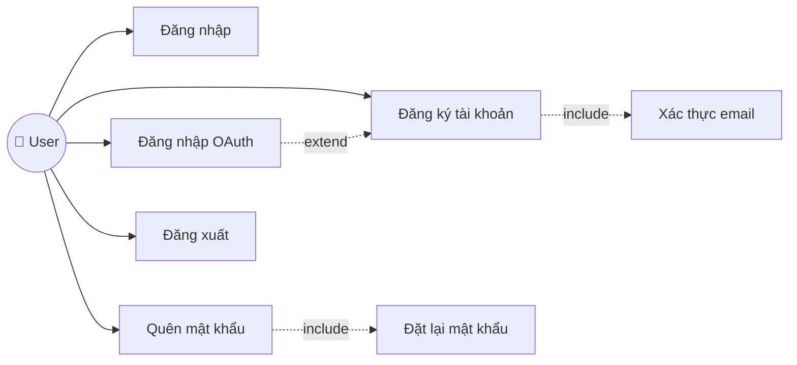
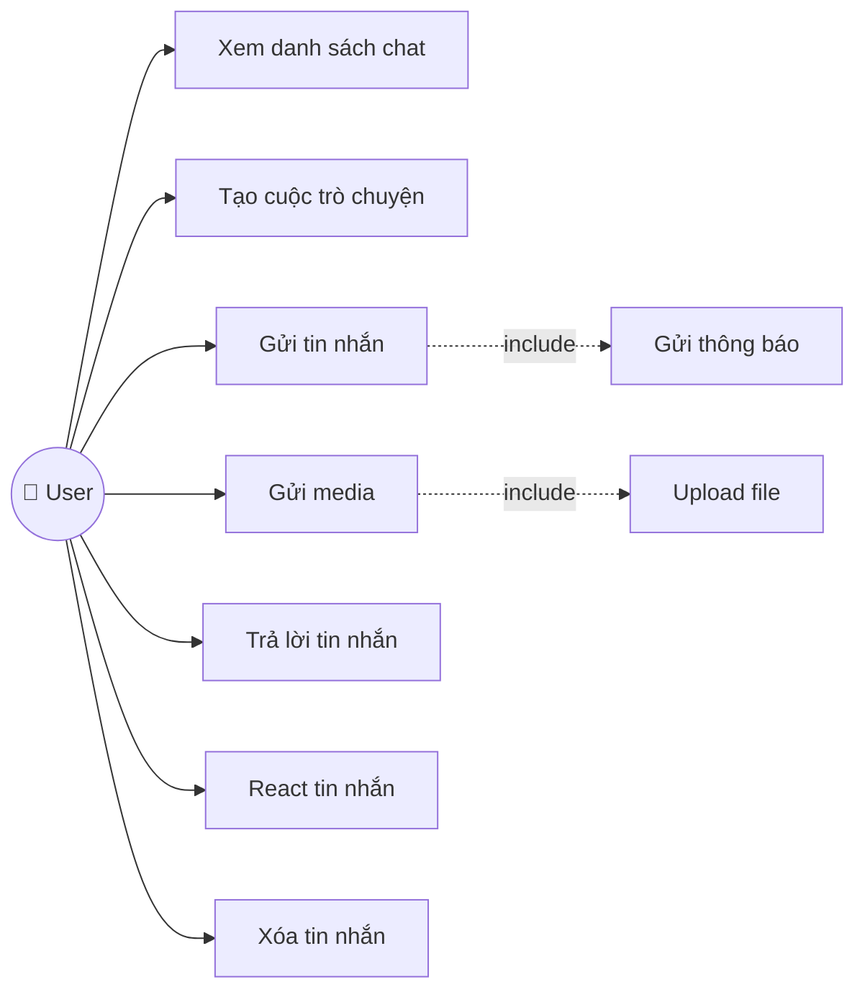
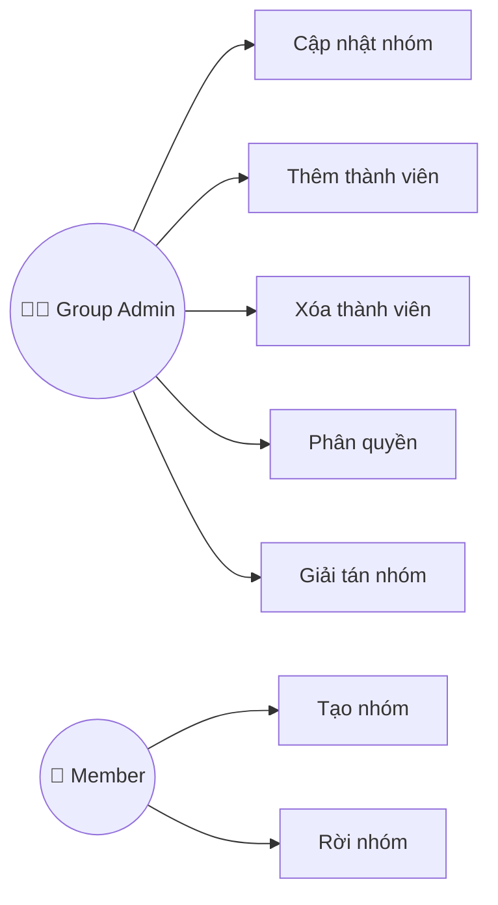
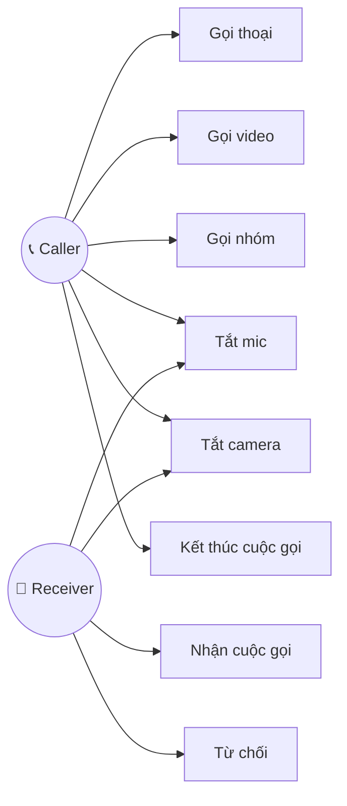
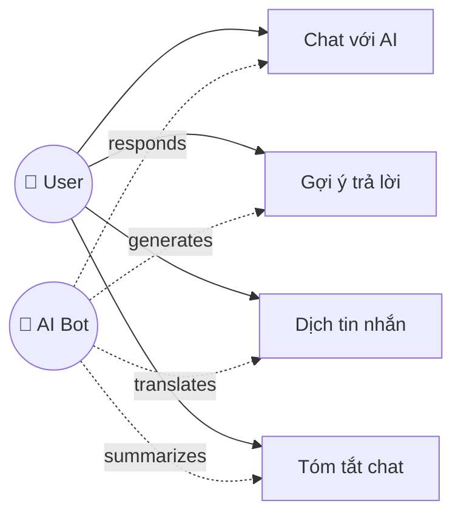

# 📊 Use Case Diagram - taklo

## Tổng Quan Hệ Thống

```mermaid
flowchart TB
    subgraph Actors
        USER[👤 Người dùng]
        ADMIN[👨‍💼 Quản trị viên]
        AI[🤖 AI Chatbot]
    end

    subgraph "Hệ thống taklo"
        subgraph "🔐 Authentication"
            UC1[Đăng ký tài khoản]
            UC2[Đăng nhập]
            UC3[Đăng nhập OAuth]
            UC4[Quên mật khẩu]
            UC5[Đăng xuất]
        end

        subgraph "👤 Quản lý Profile"
            UC6[Xem profile]
            UC7[Cập nhật profile]
            UC8[Đổi avatar]
            UC9[Quản lý bạn bè]
            UC10[Chặn người dùng]
        end

        subgraph "💬 Chat"
            UC11[Xem danh sách chat]
            UC12[Tạo cuộc trò chuyện]
            UC13[Gửi tin nhắn text]
            UC14[Gửi hình ảnh]
            UC15[Gửi video]
            UC16[Gửi file]
            UC17[Gửi sticker/emoji]
            UC18[Trả lời tin nhắn]
            UC19[React tin nhắn]
            UC20[Xóa/thu hồi tin nhắn]
            UC21[Tìm kiếm tin nhắn]
        end

        subgraph "👥 Nhóm Chat"
            UC22[Tạo nhóm mới]
            UC23[Đổi tên/avatar nhóm]
            UC24[Thêm thành viên]
            UC25[Xóa thành viên]
            UC26[Rời nhóm]
            UC27[Phân quyền admin]
            UC28[Giải tán nhóm]
        end

        subgraph "📹 Voice/Video Call"
            UC29[Gọi thoại 1-1]
            UC30[Gọi video 1-1]
            UC31[Gọi nhóm]
            UC32[Nhận cuộc gọi]
            UC33[Từ chối cuộc gọi]
            UC34[Tắt/bật mic]
            UC35[Tắt/bật camera]
        end

        subgraph "🤖 AI Features"
            UC36[Chat với AI Bot]
            UC37[Gợi ý trả lời nhanh]
            UC38[Dịch tin nhắn]
            UC39[Tóm tắt cuộc hội thoại]
        end

        subgraph "📊 Thống kê (Admin)"
            UC40[Xem dashboard]
            UC41[Thống kê người dùng]
            UC42[Thống kê tin nhắn]
            UC43[Quản lý người dùng]
        end
    end

    USER --> UC1
    USER --> UC2
    USER --> UC3
    USER --> UC4
    USER --> UC5
    USER --> UC6
    USER --> UC7
    USER --> UC8
    USER --> UC9
    USER --> UC10
    USER --> UC11
    USER --> UC12
    USER --> UC13
    USER --> UC14
    USER --> UC15
    USER --> UC16
    USER --> UC17
    USER --> UC18
    USER --> UC19
    USER --> UC20
    USER --> UC21
    USER --> UC22
    USER --> UC23
    USER --> UC24
    USER --> UC25
    USER --> UC26
    USER --> UC27
    USER --> UC28
    USER --> UC29
    USER --> UC30
    USER --> UC31
    USER --> UC32
    USER --> UC33
    USER --> UC34
    USER --> UC35
    USER --> UC36
    USER --> UC37
    USER --> UC38
    USER --> UC39

    ADMIN --> UC40
    ADMIN --> UC41
    ADMIN --> UC42
    ADMIN --> UC43
    ADMIN --> UC2

    AI --> UC36
    AI --> UC37
    AI --> UC38
    AI --> UC39
```

---

## Chi Tiết Từng Module

### 1. 🔐 Authentication Use Cases

| Use Case | Mô tả | Điều kiện tiên quyết |
|----------|-------|---------------------|
| Đăng ký | Tạo tài khoản mới với email/phone | Chưa có tài khoản |
| Đăng nhập | Truy cập với email + password | Có tài khoản |
| Đăng nhập OAuth | Login bằng Google/Facebook | Có tài khoản liên kết |
| Quên mật khẩu | Gửi link reset password | Có tài khoản |
| Đăng xuất | Kết thúc phiên đăng nhập | Đã đăng nhập |

---

### 2. 💬 Chat Use Cases

| Use Case | Actor | Mô tả |
|----------|-------|-------|
| Gửi tin nhắn text | User | Gửi nội dung văn bản |
| Gửi hình ảnh | User | Upload và gửi ảnh |
| Gửi video | User | Upload và gửi video |
| Gửi file | User | Upload tài liệu |
| Trả lời tin nhắn | User | Reply một tin nhắn cụ thể |
| React tin nhắn | User | Thêm emoji reaction |
| Xóa tin nhắn | User | Thu hồi tin đã gửi |

---

### 3. 👥 Group Management Use Cases

---

### 4. 📹 Voice/Video Call Use Cases

---

### 5. 🤖 AI Chatbot Use Cases

---

## 📋 Bảng Tổng Hợp Use Cases

| ID | Use Case | Actor | Priority | Phase |
|----|----------|-------|----------|-------|
| UC1 | Đăng ký tài khoản | User | High | 1 |
| UC2 | Đăng nhập | User | High | 1 |
| UC3 | Đăng nhập OAuth | User | Medium | 1 |
| UC6 | Xem/Cập nhật profile | User | High | 1 |
| UC11 | Xem danh sách chat | User | High | 2 |
| UC13 | Gửi tin nhắn text | User | High | 2 |
| UC14-16 | Gửi media | User | High | 2 |
| UC22 | Tạo nhóm | User | Medium | 3 |
| UC29-30 | Gọi thoại/video | User | Medium | 3 |
| UC36 | Chat với AI | User | Medium | 4 |
| UC40-43 | Dashboard Admin | Admin | Low | 4 |

---

## 🔗 Mối Quan Hệ

### Include (bắt buộc)
- Gửi media → Upload file
- Gọi điện → Kết nối WebRTC
- Đăng ký → Xác thực email

### Extend (tùy chọn)
- Đăng nhập ← OAuth
- Gửi tin nhắn ← Gửi sticker
- Chat nhóm ← Gọi nhóm

### Generalization (kế thừa)
- Gửi media: Gửi ảnh, Gửi video, Gửi file
- Cuộc gọi: Gọi thoại, Gọi video, Gọi nhóm
